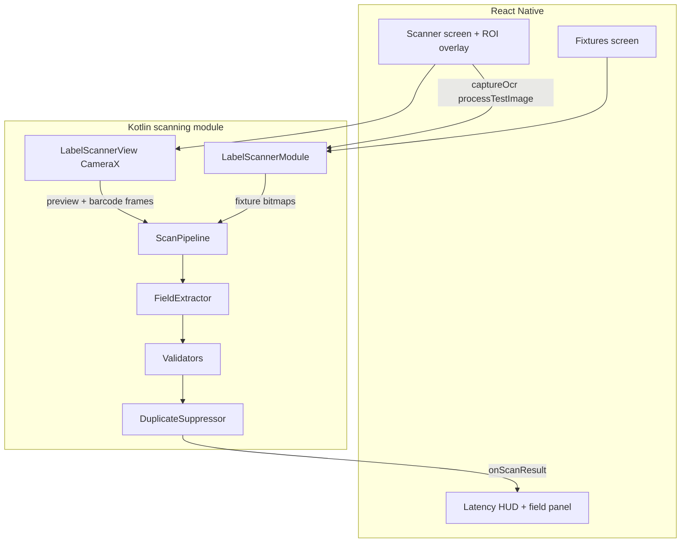

# Android / React Native Label Scanner

A small review app for **label capture**, not a theory dump: one Android camera pipeline, one JSON template, two named fields, and tests you can rerun.

Live scanning is **Android-only**. The React Native UI hosts a Kotlin CameraX + ML Kit module, draws a user-movable region of interest, and shows latency plus validation on every result.

## What to run

Full install, emulator, terminal vs Android Studio, and troubleshooting: **[HOWTORUN.md](./HOWTORUN.md)**.

Short version: you do **not** have to import the JS tree into Android Studio. From `LabelScanner`:

```bash
npm test
npm run android
```

## Required features

| Feature | Where it lives |
| --- | --- |
| Camera preview | Kotlin `LabelScannerView` + CameraX `PreviewView` |
| Real-time barcode scanning | CameraX `ImageAnalysis` + ML Kit Barcode, ~8 fps, ROI-filtered |
| Single-shot OCR | CameraX `ImageCapture` → ML Kit Text Recognition |
| User-selectable ROI | JS overlay (`RoiOverlay`) pushed to native as normalized `left/top/right/bottom` |
| Two named fields | `lotNumber` and `expiryDate` in `src/templates/pharma-label-v1.json` |
| JSON template profile | Same file, loaded by JS and parsed in Kotlin `TemplateProfile` |
| Regex / checksum validation | Field regex + GS1 EAN-13 check digit (`Validators.kt`) |
| Duplicate-result suppression | `DuplicateSuppressor` (1.5 s window from the template) |
| Latency on screen | Native `elapsedRealtime` → HUD (`BARCODE N ms`, `OCR N ms`) |
| Saved test images + expected results | `testdata/images` + `testdata/expected` |
| Kotlin module on RN | `LabelScannerPackage` registered in `MainApplication` |
| Architecture README | this file |

## Architecture



**Split of work**

- React Native owns interaction: permission, ROI handles, buttons, result layout, fixture gallery.
- Kotlin owns vision: camera lifecycle, barcode stream, still capture, OCR, cropping, regex/checksum, duplicate keys, latency timestamps.
- The JSON template is the contract. Changing anchors, regexes, or the duplicate window does not require a new native build of extraction rules, only a profile edit.

The native surface is a classic `ReactPackage` (module + `SimpleViewManager`) registered by hand. That is easier to read than codegen TurboModules for a review app; the New Architecture is still on (`newArchEnabled=true`) and the interop layer hosts the view.

## Pipeline

1. **Preview** — CameraX preview on a `TextureView` (`COMPATIBLE` mode) so Fabric can composite the JS ROI overlay.
2. **Barcode (continuous)** — `ImageAnalysis` with `STRATEGY_KEEP_ONLY_LATEST`. Frames faster than 120 ms are dropped. Detections whose bounding box misses the ROI are ignored.
3. **OCR (button)** — `ImageCapture` still, cropped to the ROI, then Latin text recognition. This is intentionally not a video OCR loop.
4. **Extraction** — For each template field: same-line text after an anchor (`LOT ABC1234`), else nearest neighbor block, else regex hunt on the full transcript.
5. **Validation** — Field regex; barcodes use the EAN-13 check digit when the profile asks for `ean13` or the format is `EAN_13`.
6. **Dedup** — Key is `barcode::lot=…|expiry=…`. Same key inside `duplicateWindowMs` is emitted with `duplicate: true` so the HUD can show **DUPLICATE SUPPRESSED** without treating it as a new scan.
7. **Latency** — `SystemClock.elapsedRealtime()` from frame/capture start to emit. Shown separately for barcode vs OCR because they are different use cases.

## Trade-offs

**CameraX vs Camera2.** CameraX binds preview, analysis, and capture to the Activity lifecycle and survives rotation without a custom Camera2 session. You give up some per-device control; for a scanner that is the right default.

**ML Kit vs Tesseract / a cloud OCR API.** ML Kit is on-device, has a barcode detector that shares the same camera session, and avoids network latency. Tesseract would need a JNI build and more CPU. A cloud API would be more accurate on damaged print but would make the latency HUD measure RTT instead of vision, and would ship label photos off-device.

**Single-shot OCR vs real-time OCR.** Barcode detection is cheap enough for a throttled stream. OCR on every frame heats the device, burns battery, and produces flickering field values. A button-triggered still is the honest UX for two sparse fields on a label.

**Crop-then-OCR vs OCR-then-filter.** Fixtures and still captures crop to the ROI so the recognizer never sees shelf clutter. The live barcode path filters ML Kit boxes against the ROI instead of converting every YUV frame to a bitmap; that keeps the 8 fps budget.

**ROI in view space.** The overlay is normalized to the preview view. Mapping that rectangle onto a rotated `ImageProxy` assumes fill-center and similar aspect. A production app would use CameraX `CoordinateTransform`. The simplification is documented here so you do not treat the boxes as photogrammetry.

**Classic native module vs TurboModule / Fabric component.** Codegen would give typed specs and faster JNI. It also hides the bridge behind generated classes, which is worse for a review project whose point is to see the seam. Interop is enough.

**Template-driven fields vs hardcoded Kotlin.** Two fields could be `if (line.startsWith("LOT"))`. A JSON profile is the thing you would extend to a third field or a second label type without rewriting the camera module.

**Duplicate window policy.** This implementation is a cooldown: the same key may emit again after 1.5 s. An edge-triggered policy (emit on appear, silent until the code leaves the frame) needs absence tracking and is nicer in a warehouse gun; it is also harder to demo.

## Test images

| Image | Expected |
| --- | --- |
| `testdata/images/valid-pharma-label.png` | LOT `ABC1234`, EXP `12/31/2027`, EAN-13 `5901234123457` valid |
| `testdata/images/invalid-lot-regex.png` | LOT `AB#12` invalid, expiry and EAN valid |
| `testdata/images/invalid-ean-checksum.png` | LOT `XYZ9876`, EXP `06/15/2028`, EAN `5901234123450` checksum fail |
| `testdata/images/duplicate-of-valid.png` | Same payload as the valid label; used to show suppression |

Expected JSON sits next to the images in `testdata/expected`. Copies of the PNGs are in `android/app/src/main/assets/testdata` so `LabelScannerModule.processTestImage` can decode them without the camera.

Jest (`__tests__/pipeline.test.ts`) checks template shape, regex, EAN-13, extraction, and the duplicate window. JVM tests in `android/app/src/test` cover the same Kotlin types. On-device fixture replay is the only test that exercises ML Kit.

## Project layout

```
LabelScanner/
  App.tsx
  src/templates/pharma-label-v1.json
  src/native/LabelScanner.ts          # RN bridge
  src/screens/ScannerScreen.tsx
  src/screens/FixturesScreen.tsx
  testdata/images|expected
  android/app/src/main/java/com/labelscanner/scanner/
    LabelScannerPackage.kt
    LabelScannerModule.kt
    LabelScannerView.kt
    ScanPipeline.kt
    FieldExtractor.kt
    Validators.kt
    DuplicateSuppressor.kt
    RoiCropper.kt
```
